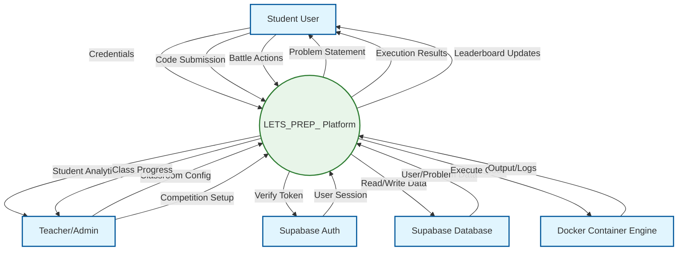
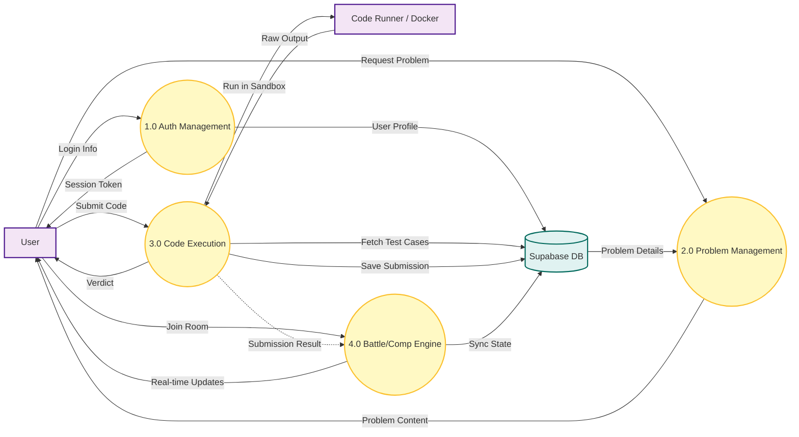
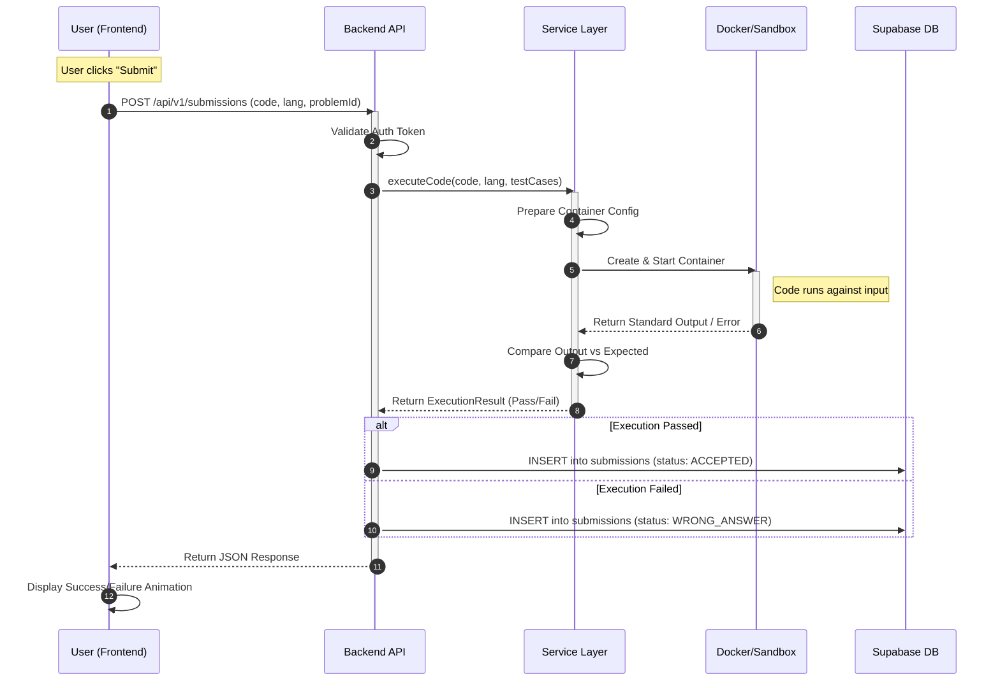
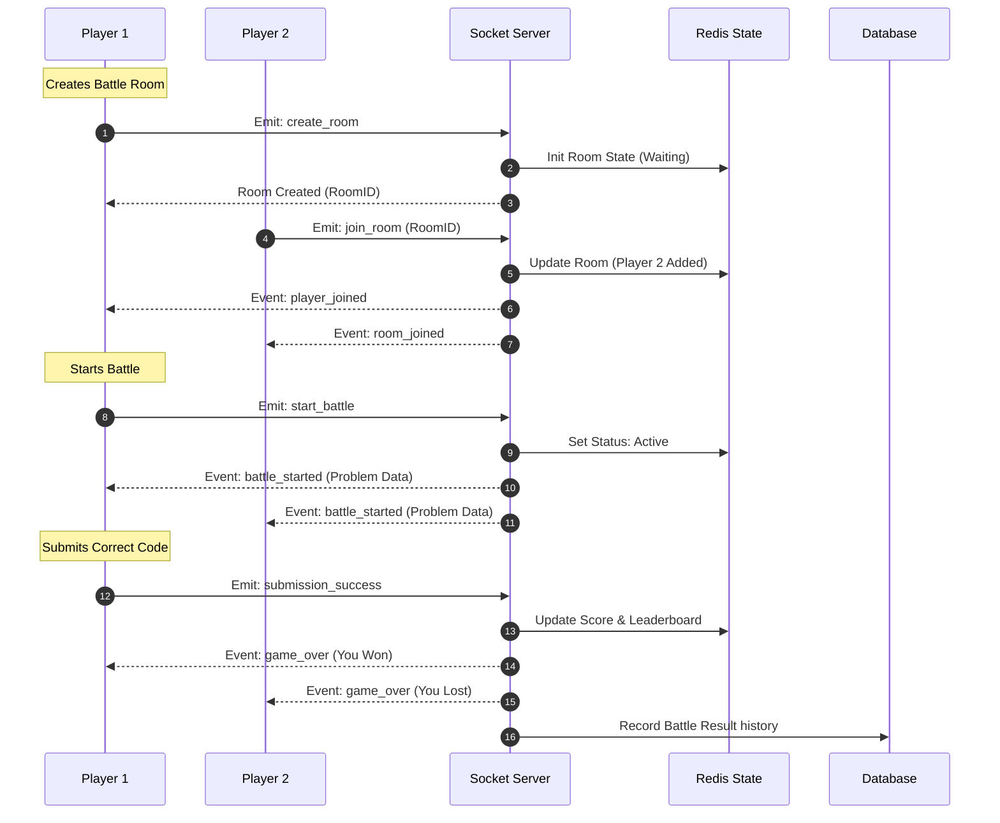

# Project Diagrams

This document contains high-quality Data Flow Diagrams (DFD) and System Flow Diagrams for the LETS_PREP_ platform.

## 1. Data Flow Diagram (DFD) - Level 0 (Context Diagram)

This diagram represents the entire LETS_PREP_ system as a single process, interacting with external entities.

---

## 2. Data Flow Diagram (DFD) - Level 1

This diagram breaks down the system into its core functional sub-processes.

---

## 3. System Flow Diagram (Sequence) - Code Submission Flow

This details the exact sequence of events when a user submits a solution.

---

## 4. System Flow Diagram (Sequence) - Real-time Battle

This details the flow of a multiplayer coding battle.

